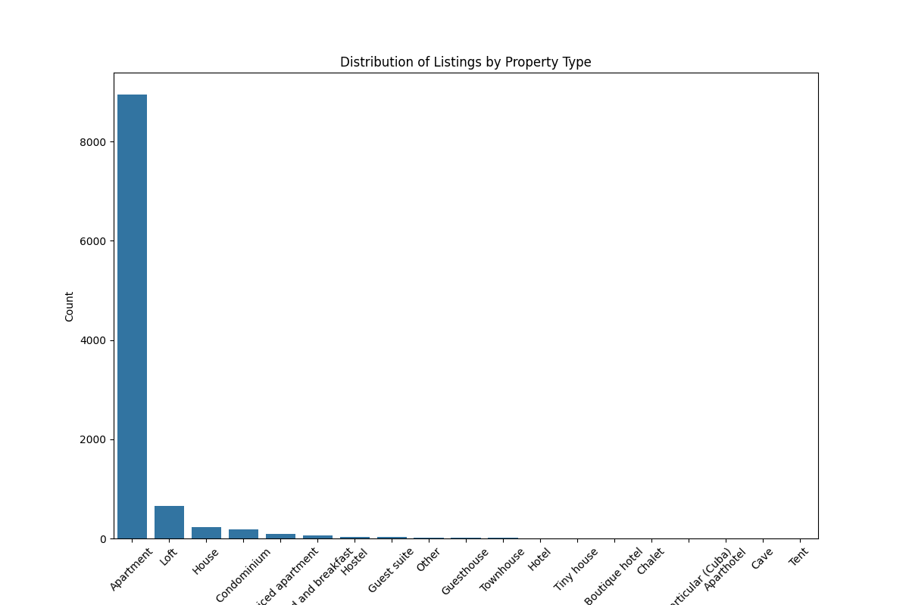
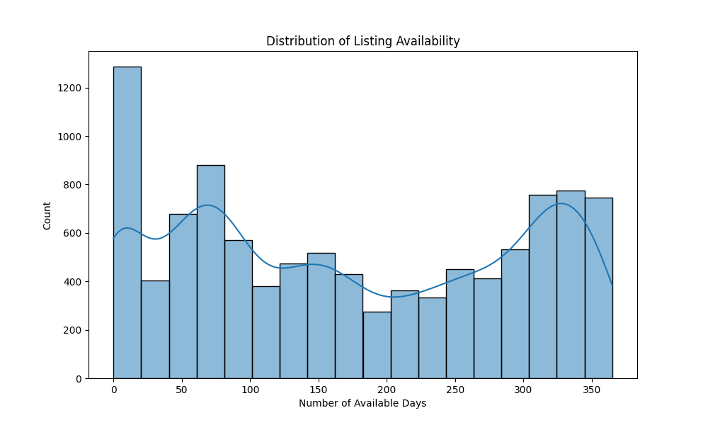
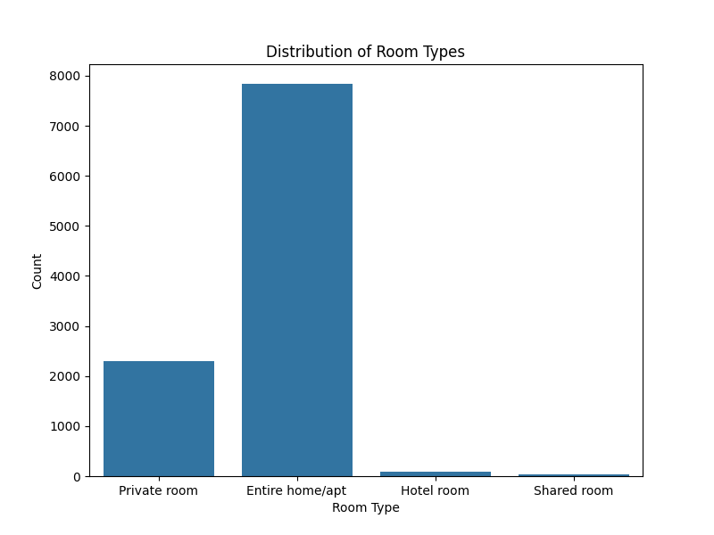
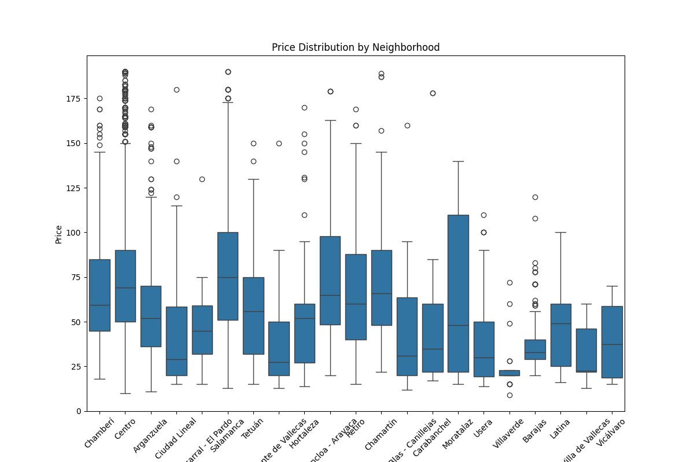
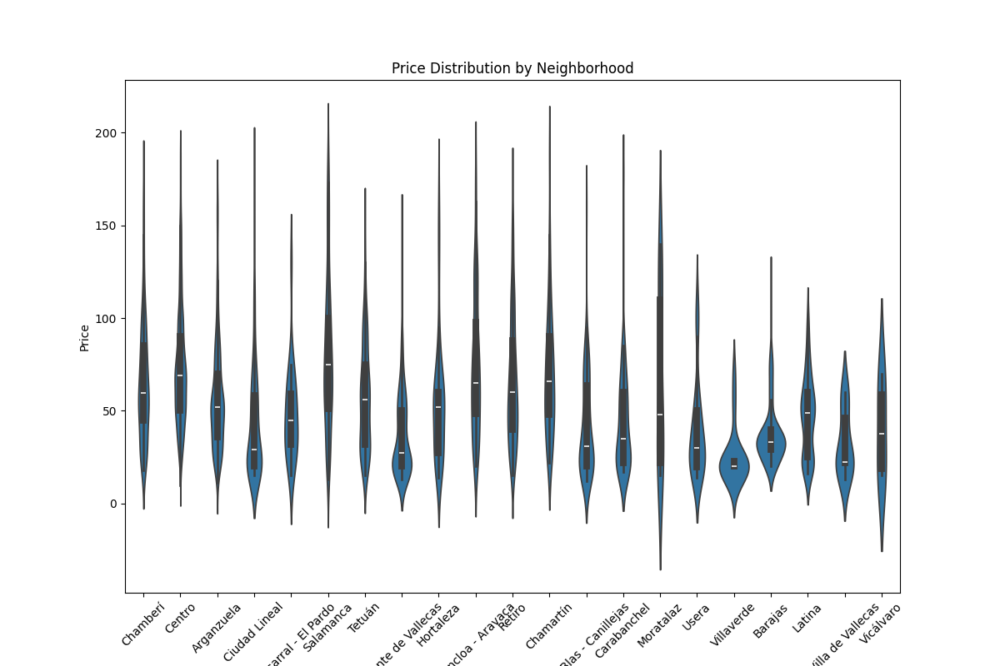
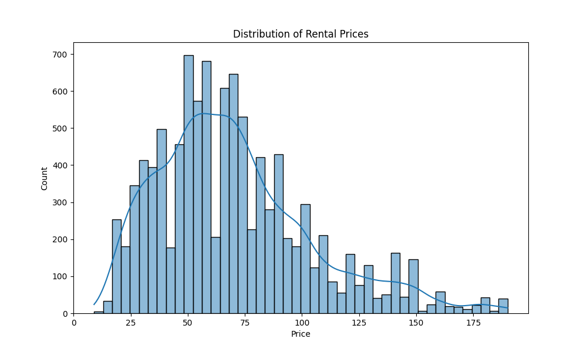

# Technical Challenge

## Documentation

[index.html](docs%2Fhtml)

## Environment

Setup:

    make requirements 

## Loading datasets

Loading and preparation of data:

    make data /PROJECT_DIR/data/raw /PROJECT_DIR/data/interim

## Feature extraction

    make features /PROJECT_DIR/data/interim /PROJECT_DIR/data/processed

## Analysis

### Exploratory analysis (EDA)

* Describe the situation of the temporary rental market on Airbnb in the city of Madrid at a general level.
* Visual descriptions and exploitation of the richness of the data will be valued.
  * Making use of geospatial data and/or natural language.

#### Features

#### Listings

#### Neighbourhood

##### Geolocations are shown in this map:

[property_map.html](reports%2Fproperty_map.html)

#### Reviews

### Analyze the prices of published properties.

## Prediction

* Train a model capable of predicting the daily rental price of a property on Airbnb.
* In addition to the metrics obtained, the justification of the model construction process will be assessed. Creativity in the construction of new variables (using geolocation data and/or unstructured text) and the use of different predictive techniques.
  * variables used/discarded
  * evaluation metric/s, model selection/s

    make train /PROJECT_DIR/data/processed
    make predict /PROJECT_DIR/data/processed

## Deployment

[Deployment solution](references%2FCHALLENGE.md)

## Report

[Report of results](references%2FREPORT.md)
